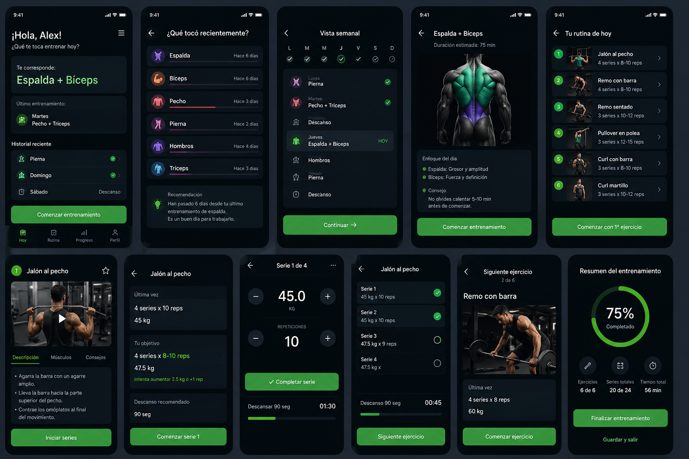

# Iron Kata


Aplicación Android offline enfocada en responder una sola pregunta al abrirla: **¿qué me toca entrenar hoy?**

<p align="center">
  
</p>

Toda la implementación vive en [`app/`](app/): una app 100% offline, sin cuenta ni servidor.

## Producto implementado

- Inicio directo con rutina recomendada, historial semanal, explicación y primer ejercicio.
- Secuencia real de rutinas que avanza por el último entrenamiento completado, aunque se falte uno o varios días.
- Días de descanso dentro de la secuencia y entrenamientos rápidos que no alteran esa secuencia.
- Rutinas predefinidas y editor simple de rutinas personalizadas.
- Ejecución serie por serie con peso, repeticiones, valores previos y temporizador basado en una hora de finalización persistida.
- Doce demostraciones fotográficas WebP animadas, locales y en bucle.
- Resumen final con celebración Lottie, récords personales y estimación 1RM mediante Epley.
- Historial, volumen por grupo muscular, peso corporal y tendencia básica.
- Nutrición opcional con calorías, proteína y alimentos.
- Importación y exportación de respaldos JSON.
- Persistencia SQLite local, sin cuenta, servidor ni conexión obligatoria.

## Stack

React Native 0.86, Expo SDK 57, TypeScript, Zustand, SQLite, React Navigation, Reanimated, Lottie y Expo Image. El diseño usa fondo negro/carbón, tarjetas oscuras y acento verde lima conforme a las referencias de [`img/`](img/).

## Desarrollo

Se utiliza exclusivamente pnpm:

```powershell
cd C:\Repos\iron-Kata\app
pnpm install
pnpm typecheck
pnpm test
pnpm start
```

Para regenerar el proyecto Android y compilar localmente:

```powershell
pnpm prebuild:android
pnpm build:apk
```

El SDK Android debe estar disponible mediante `ANDROID_HOME` o `app/android/local.properties`. El APK de Gradle se genera en `app/android/app/build/outputs/apk/release/app-release.apk`.

## APK

El repositorio distribuye únicamente el código fuente: el APK release (~115 MB) no se versiona aquí, se genera localmente con `pnpm build:apk`.

- Paquete Android: `com.ironkata.app`
- Versión vigente: `1.0.4` (`versionCode` 5)
- Android mínimo: 7.0 (API 24)

Para desplegar por depuración inalámbrica usa `tools/deploy.sh`. El script compila únicamente `app/`, comprueba que el paquete sea `com.ironkata.app` y luego instala/copia la APK generada.

## Transferencia MTP

`tools/deploy-mtp.ps1` usa Windows Shell COM y debe ejecutarse con Windows PowerShell clásico en apartamento STA. No utiliza ADB:

```powershell
C:\Windows\System32\WindowsPowerShell\v1.0\powershell.exe -NoProfile -Sta -ExecutionPolicy Bypass -File C:\Repos\iron-Kata\tools\deploy-mtp.ps1 -SourceApk C:\Repos\iron-Kata\Iron-Kata-OFICIAL-v1.0.4.apk
```

El script navega `Este equipo` como namespace Shell, elimina APK anteriores de Iron Kata, copia de forma asíncrona y verifica nombre, tipo y tamaño expuestos por MTP.
